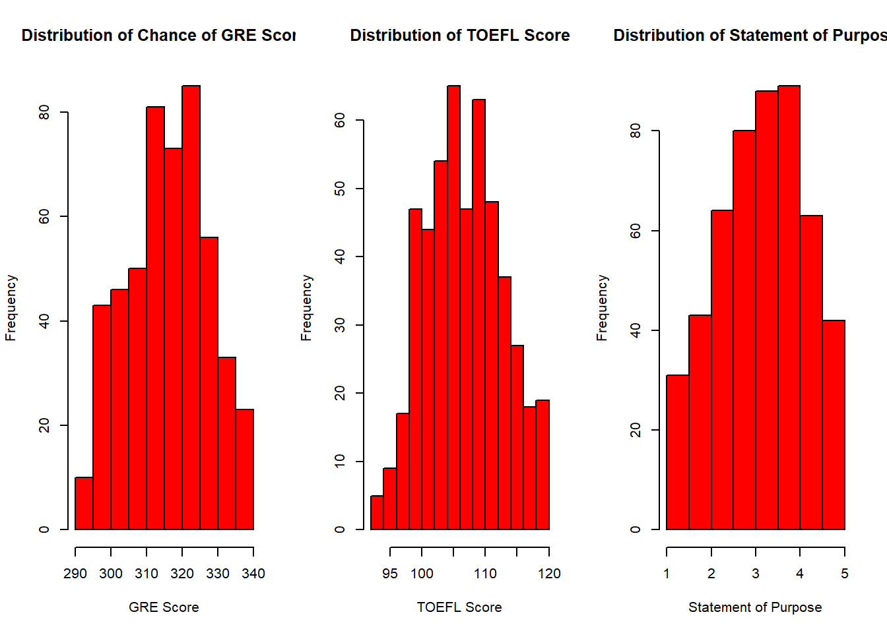
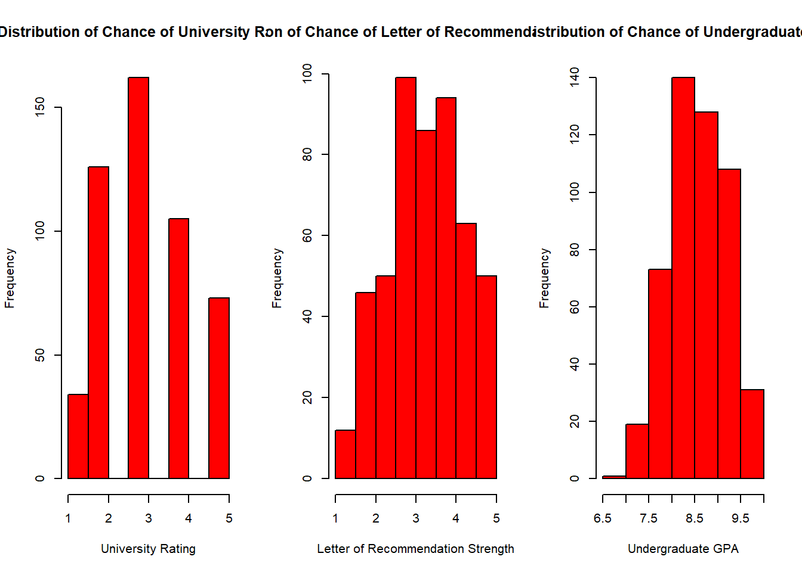

```{r setup, include=FALSE}
knitr::opts_chunk$set(echo = TRUE, fig.align = "center", warning = F, message = F)
```

<style>
body {
text-align: justify}
</style>


# Intro {.tabset .tabset-pills}
## What We'll do
We will learn to use linear regression model using grad student admission dataset. We want to know the relationship among variables, especially between the Chance of Admit with other variables. We also want to predict the Chance of Admit based on the historical data.

## Business Goal

This dataset is created for prediction of Graduate Admissions from an Indian perspective. , inspired by the UCLA Graduate Dataset. The test scores and GPA are in the older format.

    This dataset was built with the purpose of helping students in shortlisting          universities with their profiles. The predicted output gives them a fair idea about their chances for a particular university. 


# Data Preparation {.tabset .tabset-pills}

Load the required package.
```{r message = FALSE}
library(tidyverse)
library(caret)
library(plotly)
library(data.table)
library(GGally)
library(tidymodels)
library(car)
library(scales)
library(lmtest)
library(leaps)
library(texreg)


options(scipen = 100, max.print = 1e+06)
```

Load the data set 
```{r}
grad <- read.csv("data/graduateadmission.csv")

rmarkdown::paged_table(grad)
```
We have correct data type, then we are ready to be process.

Cleaning data that will not be using throughout the modelling
```{r}
grad <-  grad %>% 
  select(-(c(Serial.No.)))
```

Check any NA data
```{r}
anyNA(grad)
```
Our data is ready to be proccess because it doesn't have anyNA data

Check summary of the data
```{r}
str(grad)
dim(grad)
```
**Variable Explanation**

* **GRE.Score** : The `Graduate Record Examinations` is a standardized test that is an admissions requirement for many graduate schools in the United States and Canada

* **TOEFL.Score** : Test of `English as a Foreign Language` is a standardized test to measure the English language ability of non-native speakers wishing to enroll in English-speaking universities

* **University.Rating** : College and university rankings are rankings of institutions in higher education which have been ranked on the basis of various combinations of various factors

* **SOP** :  Reflection of your personality that you portray in front of the admission committee (Adcom) for getting enrolled in universities abroad

* **LOR** : Document that provides the admission officers with a comprehensive insight into your suitable candidature, for admission into the concerned university.

* **CGPA**: Academic performance from 0.00–4.00, calculated as an average of your GPA from all completed terms/semesters

* **Research**: University that is committed to research as a central part of its mission. Some students has doing this when they hadn't been into the college. 

* **Change.of.Admit**: Probability the student who has been submit their application is success enroll to the university


The data has 500 rows and 8 columns. Serial.No. is a unique identifier for each car, so we can ignore it. Our target variable is the `Chance.of.Admit`, which signifies the score of the students. We will use other variable except the `Serial No`.

Before we go further, first we need to make sure that our data is clean and will be useful. If you watch closely, there are some problems with the categorical variable. For example, look at the `prop.table of each variable`  below. 
```{r}
prop.table(table(grad$GRE.Score))
prop.table(table(grad$TOEFL.Score))
prop.table(table(grad$University.Rating))
prop.table(table(grad$SOP))
prop.table(table(grad$LOR))
prop.table(table(grad$CGPA))
prop.table(table(grad$Research))
prop.table(table(grad$Chance.of.Admit))

qqnorm(grad$Chance.of.Admit)
qqline(grad$Chance.of.Admit, col = 2)
```
We can see from the histogram that the distribution of our response variable looks normally distributed. And the qqline is roughly straight, so it is approximately normal distributed.

Next, we can plot data of our predictor columns to check their distribution. 
```{r}

```
```{r}

```
According to our histogram, we can see the data distribution of these numerical columns appear to be approximately normal. So we do not need to transform them to be more normal now.

# Exploratory Data Analysis {.tabset .tabset-pills}

Exploratory data analysis is a phase where we explore the data variables, see if there are any pattern that can indicate any kind of correlation between variables.

Find the Pearson correlation between features.
```{r}
ggcorr(grad, label = TRUE, label_size = 2.9, hjust = 1, layout.exp = 2)
```
The graphic shows that a lot of variable has strong correlation with the `Chance.of.Admit` variables.


# Modeling {.tabset .tabset-pills}
## Holdout :Train-TestSplit
Before we make the model, we need to split the data into train dataset and test dataset. We will use the train dataset to train the linear regression model. The test dataset will be used as a comparasion and see if the model get overfit and can not predict new data that hasn’t been seen during training phase. We will 50% of the data as the training data and the rest of it as the testing data.

```{r}
set.seed(123)
samplesize <- round(0.5 * nrow(grad), 0)
index <- sample(seq_len(nrow(grad)), size = samplesize)

train_set <- grad[index,] # taining set
test_set <- grad[-index,]  # test set
```

Now we have training set of 250 rows and test dataset of same rows.

## Linear Regression

Now we will try to model the linear regression using `Chance.of.Admit` as the target variable
```{r}
set.seed(123)
grad_lm <- lm(Chance.of.Admit ~ ., data = grad)

summary(grad_lm)
```
After the preprocessing of dataset, now we can fit a linear model. To cycle through all possible combinations of predictors and generate set of best performing models, we will use the regsubset.

```{r}
# using regsubsets to select predictors subset, set method = exhaustive
regsubsets.out <- regsubsets(Chance.of.Admit ~ .,
                              data = grad,
                              nbest = 1,  # number of subsets of each size to record
                              nvmax = NULL,  # maximum size of subsets to examine
                              force.in = NULL, force.out = NULL,
                              method = 'exhaustive')
```

```{r}
# converts this to dataframe and show the choosing result
as.data.frame(summary(regsubsets.out)$outmat)
```
Then we use Adjusted Rsq value to estimate performance of each predictors.
```{r}
# create plot of results, it includes fit performance information
plot(regsubsets.out, scale='adjr2', main='Adjusted Rsq')
```
We can see from the plot that CGPA has the smallest adjr2 value as a predictor.

# Model Selection {.tabset .tabset-pills}

Next, we should select the optimum model base on the slection results of predictors. 

*1. We we build a linear model with CGPA as the single predictor*
```{r}
lm.single <- lm(Chance.of.Admit ~ CGPA, data = train_set)
plot(lm.single)
```
*2. Linear model, we choose CGPA, GRE.Score, and TOEFL.Score as our predictors to train model.*
```{r}
lm.multi <- lm(Chance.of.Admit ~ CGPA + TOEFL.Score + GRE.Score, data = train_set)
plot(lm.multi)
```

*3.Finally, we fit a model that use all predictors*
```{r}
lm.full <- lm(Chance.of.Admit ~ ., data = train_set)
```

Now that we have generated three models and get some discriptive information of them. To choose the optimal one out of them, we need to evaluate performance of chosen model on our test dataset.


```{r}
# calculate the rmse and r2 of each model
model_single_rmse <- RMSE(lm.single$fitted.values, obs = train_set$Chance.of.Admit)
model_multi_rmse <- RMSE(lm.multi$fitted.values, obs = train_set$Chance.of.Admit)
model_full_rmse <- RMSE(lm.full$fitted.values, obs = train_set$Chance.of.Admit)
model_rmse_table <- data.frame(model_single_rmse, model_multi_rmse, model_full_rmse)
model_rmse_table
```
```{r}
# calculate the rsq value of trained model
model_single_rsq <- cor(lm.single$fitted.values, train_set$Chance.of.Admit)^2
model_multi_rsq <- cor(lm.multi$fitted.values, train_set$Chance.of.Admit)^2
model_full_rsq <- cor(lm.full$fitted.values, train_set$Chance.of.Admit)^2
model_rsq_table <- data.frame(model_single_rsq, model_multi_rsq, model_full_rsq)
model_rsq_table
```
```{r}
# we can also use screenreg to show imformation about our model and choose the optimal one
screenreg(list(lm.single, lm.multi, lm.full))
```
We can see from the result : that `model, lm.full using all predictors` has the `largest R^2` value as well as the smallest RMSE value, thus, we choose this model as our optimal one. And the formula for our linear model is 

# Cross Validation {.tabset .tabset-pills}
We use 10-fold cross validation method.k-fold cross-validation method evaluates the model performance on different subset of the training data and then calculate the average prediction error rate

```{r}
# First we Define training control, 
set.seed(2) 
train.control <- trainControl(method = "cv", number = 10)
# Train the model
cv.lm.full <- train(Chance.of.Admit ~ ., data = train_set, method = "lm",
               trControl = train.control)
# Summarize the results
print(cv.lm.full)
```

# Evaluation {.tabset .tabset-pills}

After choosing the model with the best performance measure, we can make predictions using our trained model and store in the test dataset

prediction evaluation result using all predictor model lm.full:

```{r}
# making prediction
test_set$full_model_output <- predict(lm.full, newdata = test_set)
```


*Calculate the RMSE and R2 value of our testset* 
```{r}
# calculate the RMSE on the test dataset
testset_rmse <- RMSE(test_set$full_model_output, obs = test_set$Chance.of.Admit)
testset_rmse
```
*Calculate the RMSE and R2 value of our test data set* 
```{r}
# calculate the R2 value on the test dataset
testset_rsq <- cor(test_set$full_model_output, test_set$Chance.of.Admit)^2
testset_rsq
```

*Evaluation result*: It can be seen from above that our RMSE value on test dataset is 0.065 the model RMSE, and the rsq value is 0.8041162, which are little lower than that of model rsq, which is 0.84.

# Conclusion

Variables that are useful to describe the variances in car prices are GRE.Score, TOEFL Score, University Rating, SOP, LOR, CGPA, Research, and Chance of Admit. 

**Our final model**
The R-squared of the model of `full model output is quite high`, with *83.7%* of the variables can explain the variances in the `Chance of Admit`.

We have already learn how to build a linear regression model and what need to be concerned when building the model.
